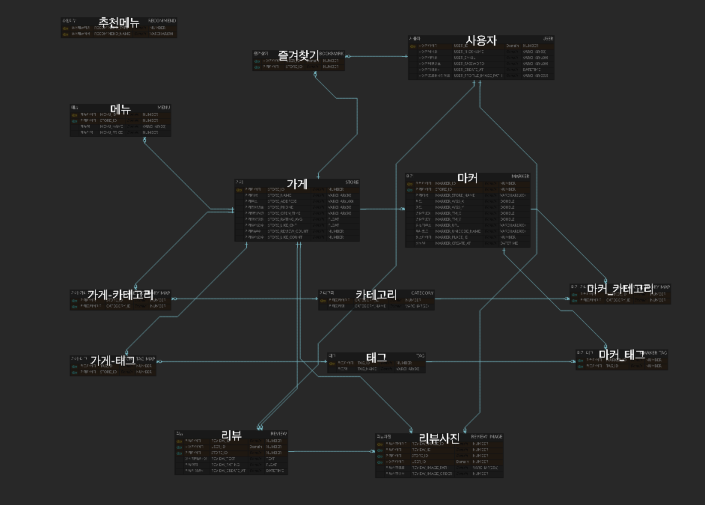

<div align="center">

<!-- logo -->


### BabPool 🍚  
### 위치 기반 음식점 추천 & 리뷰 웹 서비스

</div>

---

## 📝 소개

**BabPool(밥풀)** 은  
사용자의 위치와 취향을 기반으로 음식점을 탐색하고  
리뷰, 북마크, 랜덤 추천 기능을 제공하는 **음식점 추천 & 리뷰 웹 서비스**입니다  

단순한 목록형 검색이 아니라  
- 카테고리 / 태그 기반 분류
- 지도 마커 연동
- 랜덤 음식점 추천
- 관리자 전용 관리 페이지

를 통해 **실제 서비스 흐름을 고려한 웹 애플리케이션**으로 구현했습니다

---

## 🧩 주요 기능

### 👤 사용자 기능
- 회원가입 (Gmail SMTP)
- 자동 로그인 (Filter 기반)
- 마이페이지 (프로필 이미지 업로드, 비밀번호 변경)
- 랜덤 음식 및 메뉴 추천(반응형)
- 리뷰 작성 및 삭제 (이미지 포함)
- 음식점 목록 조회 및 상세 페이지 확인
- 학교에서 음식점까지 도보 길찾기 제공


### 🛠 관리자 기능
- 사용자 전체 조회 / 상세 조회 / 수정 / 삭제
- 음식점 CRUD 관리
- 메뉴 CRUD 관리
- 리뷰 조회 / 수정 / 삭제
- 지도 마커 관리
- 카테고리 / 태그 관리 및 매핑

---

## 🖥 화면 구성

> 실제 서비스 화면 시현 영상

[[Demo Video](https://drive.google.com/file/d/1vXmAsHwdgDKym9eXFfIR_43VZyAPWv3O/view?usp=drive_link)]


---

## 🗂️ APIs

본 프로젝트는 **Servlet 기반 MVC 구조**로 구현되었으며  
기능 단위로 URL을 명확히 분리하여 설계했습니다


---

## ⚙ 기술 스택

### Back-end
- Java
- Mysql

### Front-end
- JSP
- HTML / CSS
- JavaScript
- Bootstrap

### Infra / Library
- Apache Tomcat
- MySQL Connector
- JSTL
- Jakarta Mail (Gmail SMTP 이메일 인증)
- Commons FileUpload (파일 업로드)
- Kakao API

---

## 🛠️ 프로젝트 아키텍처


### 구조 설명
- **Controller (Servlet)**  
  요청을 받아 비즈니스 로직 수행 후 JSP로 포워딩
- **DAO**  
  JDBC 기반 DB 접근 로직 분리
- **DTO**  
  계층 간 데이터 전달 객체
- **Filter**  
  자동 로그인, 로그 파일 기록
- **JSP(View)**  
  사용자 화면 렌더링

---

## 🧱 DB / ERD 설계


[ERD](https://www.erdcloud.com/d/S3fkBFGf7DZbjzDfq)


- User / Store / Review / Menu / Bookmark
- Category / Tag / Marker
- 다대다 관계를 매핑 테이블로 분리하여 정규화
- SQL 스크립트 기반 초기 데이터 구성

> `/webapp/resource/sql` 경로에 테이블 생성 및 초기 데이터 스크립트 포함

---

## 🤔 기술적 이슈와 해결 과정

### 1️⃣ 좌표계 불일치로 인한 위치 오류 문제

- **문제**  
  네이버 지도 API로 받아온 가게 위치 정보와  
  마커 표시에 사용하는 좌표가 **서로 다른 좌표계(WGS84 vs TM)**를 사용하여  
  지도상에서 엉뚱한 위치에 마커가 표시되고  
  길찾기 URL 생성 시 잘못된 좌표가 전달되는 문제가 발생함

- **해결**  
  좌표계 변환 로직(`convertWGS84To3857`)을 구현하여  
  WGS84 좌표를 TM 좌표로 변환하는 계산식을 적용함  
  변환된 좌표를 DB에 함께 저장하여  
  각 상황에 맞는 좌표계를 선택적으로 사용할 수 있도록 구현함

- **결과**  
  지도 마커가 정확한 위치에 표시되고  
  올바른 좌표 기반의 길찾기 URL 생성이 가능해져  
  사용자에게 정확한 위치 정보를 제공할 수 있게 됨

---

### 2️⃣ 파일 및 리소스 빌드 패스 누락 문제

- **문제**  
  이미지, SQL 스크립트, 외부 라이브러리를 레포지토리에 추가했음에도  
  서버 실행 시 해당 리소스가 정상적으로 로드되지 않는 문제가 발생함

- **해결**  
  프로젝트 설정에서 **Build Path에 리소스를 명시적으로 추가**하여  
  빌드 및 서버 실행 시 함께 로드되도록 설정함

- **결과**  
  개발 환경과 실행 환경 간 차이를 해소하였고  
  리소스 누락으로 인한 오류를 방지할 수 있었음

---

### 3️⃣ Servlet 매핑 오류 및 DB 처리 이후 화면 갱신 흐름 설계

- **문제**  
  `@WebServlet` 어노테이션으로 매핑한 URL과  
  JSP의 `<form action>` 경로가 일치하지 않아  
  요청이 Controller(Servlet)까지 정상적으로 전달되지 않는 문제가 발생함  
  또한 DB 처리 이후 `.jsp` 페이지를 직접 반환하면서  
  변경된 데이터가 화면에 즉시 반영되지 않는 문제가 함께 발생함

- **해결**  
  다음과 같이 요청 흐름과 역할을 명확히 분리함  
  - JSP의 form action 경로와 `@WebServlet` 매핑 값을 정확히 일치시킴  
  - **페이지 → 페이지 이동**은 JSP 단위로 처리  
  - **페이지 → DB 접근 및 비즈니스 로직**은 반드시 Servlet에서 처리  
  - DB 변경 이후에는 Servlet에서 `redirect`를 사용하여  
    최신 데이터를 다시 조회하는 흐름으로 설계함

- **결과**  
  요청 흐름이 명확해졌고  
  DB 상태와 화면 상태가 일관되게 유지되었으며  
  MVC 패턴에서 Controller와 View의 책임 분리에 대한 이해도가 향상됨

---

### 4️⃣ 리뷰 별점 및 이미지 상태 유지 문제 (JavaScript + Session + DB)

- **문제**  
  리뷰 작성 화면에서 JavaScript로 구현한  
  별점 선택 UI와 이미지 미리보기 기능이  
  페이지 이동 또는 새로고침 이후 유지되지 않는 문제가 발생함

- **해결**  
  리뷰 작성 시 선택한 별점 정보와 이미지 정보를  
  **세션에 임시 저장**하여 페이지 이동 간 상태를 유지함  
  최종 제출 시에는 Servlet을 통해  
  세션에 저장된 데이터와 함께 DB에 저장하고  
  이후 화면 렌더링 시 DB에서 조회한 값을 기준으로 화면을 구성함

- **결과**  
  페이지 이동 및 새로고침 이후에도  
  리뷰 별점과 이미지 상태가 안정적으로 유지되었고  
  프론트엔드(JavaScript) 상태 관리와  
  백엔드(Session/DB) 간의 역할 분리를 경험할 수 있었음

---

## 발표 PPT

[BabPool PPT](docs/BabPool.pdf)


## 📁 프로젝트 구조

```text
BabPool
 ├─ controller
 │   ├─ user
 │   └─ admin
 ├─ dao
 ├─ dto
 ├─ filter
 ├─ utils
 ├─ webapp
 │   ├─ jsp
 │   ├─ css
 │   ├─ js
 │   ├─ images
 │   └─ sql
 └─ logs

[Browser]
   |
   |  HTTP Request
   v
[TOMCAT]
   |
   v
[Filter Chain]  (예: AutoLoginFilter, LogFileFilter)
   |
   v
[Controller: Servlet]  (예: LoginServlet, PlaceDetailServlet, Admin*Servlet...)
   |
   |  (비즈니스 처리 / 유효성 검증 / 세션/쿠키)
   v
[DAO + DBUtil]  ---- JDBC ---->  [MySQL]
   |
   v
[DTO/VO]
   |
   v
[View: JSP] (mainPage.jsp, placeDetail.jsp, admin*.jsp...)
   |
   v
[Browser]  (HTML/CSS/JS 렌더링)

```

## 💁‍♂️ 프로젝트 팀원


Frontend & Backend

<br>
[김동국](https://github.com/catomat0) | [박수연](https://github.com/p1001q)

